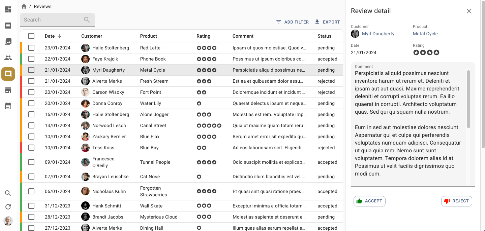

# React-admin Demo

This is a demo of the [react-admin](https://github.com/marmelab/react-admin) library for React.js. It creates a working administration for a fake poster shop named Posters Galore. You can test it online at https://marmelab.com/ra-enterprise-demo/.

[](https://marmelab.com/ra-enterprise-demo/)

This project is a fork of the open-source [e-commerce demo](https://marmelab.com/react-admin-demo/) using the following [React-admin Enterprise Edition](https://marmelab.com/ra-enterprise/) modules:

-   ra-audit-log
-   ra-calendar
-   ra-editable-datagrid
-   ra-enterprise
-   ra-form-layout
-   ra-history
-   ra-markdown
-   ra-navigation
-   ra-realtime
-   ra-relationships
-   ra-search
-   ra-tour
-   ra-tree

To explore the source code, start with [src/App.tsx](https://github.com/marmelab/react-admin/blob/master/examples/demo/src/App.tsx).

## How to run

After having cloned the react-admin repository, run the following commands at the react-admin root:

```sh
make install

make build

make run-demo
```

**Note**: This demo requires a valid subscription to [React Admin Enterprise Edition](https://marmelab.com/ra-enterprise/).

## Available Scripts

In the project directory, you can run:

### `npm start`

Runs the app in the development mode.<br>
Open [http://localhost:3000](http://localhost:3000) to view it in the browser.

The page will reload if you make edits.<br>
You will also see any lint errors in the console.

### `npm test`

Launches the test runner in the interactive watch mode.<br>
See the section about [running tests](#running-tests) for more information.

### `npm run build`

Builds the app for production to the `build` folder.<br>
It correctly bundles React in production mode and optimizes the build for the best performance.

The build is minified and the filenames include the hashes.<br>
Your app is ready to be deployed!

### `npm run deploy`

Deploy the build to GitHub gh-pages.
