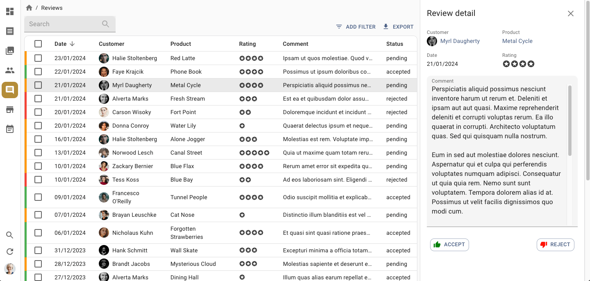

# React-admin Demo

This is a demo of the [react-admin](https://github.com/marmelab/react-admin) library for React.js. It creates a working administration for a fake poster shop named Posters Galore. You can test it online at https://marmelab.com/ra-enterprise-demo/.

[](https://marmelab.com/ra-enterprise-demo/)

This project is a fork of the open-source [e-commerce demo](https://marmelab.com/react-admin-demo/) using the following [React-admin Enterprise Edition](https://marmelab.com/ra-enterprise/) modules:

-   ra-audit-log
-   ra-calendar
-   ra-editable-datagrid
-   ra-enterprise
-   ra-form-layout
-   ra-history
-   ra-markdown
-   ra-navigation
-   ra-realtime
-   ra-relationships
-   ra-search
-   ra-tour
-   ra-tree

To explore the source code, start with [src/App.tsx](https://github.com/marmelab/react-admin/blob/master/examples/demo/src/App.tsx).

## How to run

After having cloned the react-admin repository, run the following commands at the react-admin root:

```sh
make install

make build

make run-demo
```

**Note**: This demo requires a valid subscription to [React Admin Enterprise Edition](https://marmelab.com/ra-enterprise/).

## Switching routers

The demo runs on react-admin's default router, react-router. Set `VITE_ROUTER` to
run the very same application on TanStack Router instead:

```sh
yarn start                       # react-router
VITE_ROUTER=tanstack yarn start  # TanStack Router
```

Only `<Admin routerProvider>` changes between the two, see
[src/routerProvider.ts](./src/routerProvider.ts). The rest of the demo is written
against react-admin's router-agnostic primitives (`LinkBase`, `useLocation`,
`useNavigate`, `useParams`, `useMatch`, `Navigate`) and never imports
react-router. The one exception is `<Route>` inside `<CustomRoutes>`, which the
router abstraction duck-types.

Both routers use hash URLs, since react-admin creates a hash router by default,
so a deep link such as `#/customers/1` works unchanged on either.

Note that `VITE_ROUTER` is inlined when Vite serves the file, so switching routers
means restarting the dev server, not just reloading the page. To compare the two,
run them side by side on different ports:

```sh
yarn start --host                                                # react-router
VITE_ROUTER=tanstack yarn start --host --port 8002 --strictPort   # TanStack Router
```

## Available Scripts

In the project directory, you can run:

### `npm start`

Runs the app in the development mode.<br>
Open [http://localhost:3000](http://localhost:3000) to view it in the browser.

The page will reload if you make edits.<br>
You will also see any lint errors in the console.

### `npm test`

Launches the test runner in the interactive watch mode.<br>
See the section about [running tests](#running-tests) for more information.

### `npm run build`

Builds the app for production to the `build` folder.<br>
It correctly bundles React in production mode and optimizes the build for the best performance.

The build is minified and the filenames include the hashes.<br>
Your app is ready to be deployed!

### `npm run deploy`

Deploy the build to GitHub gh-pages.
